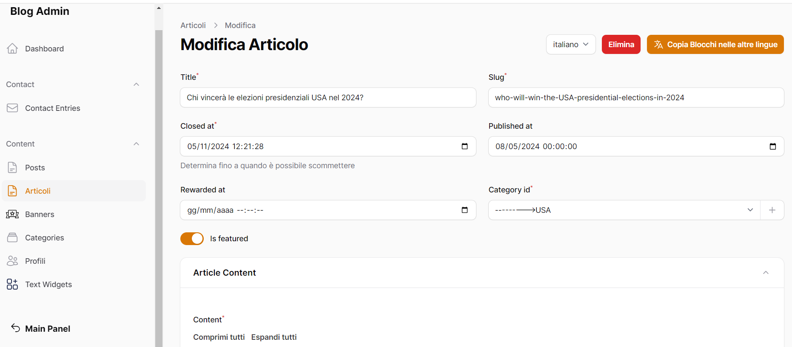
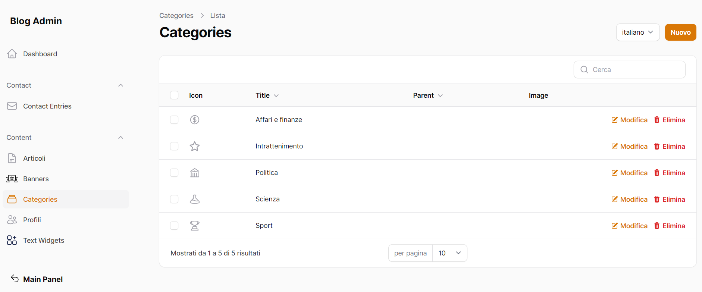
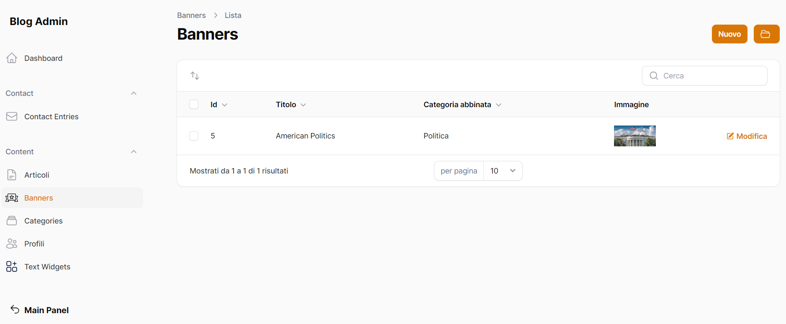
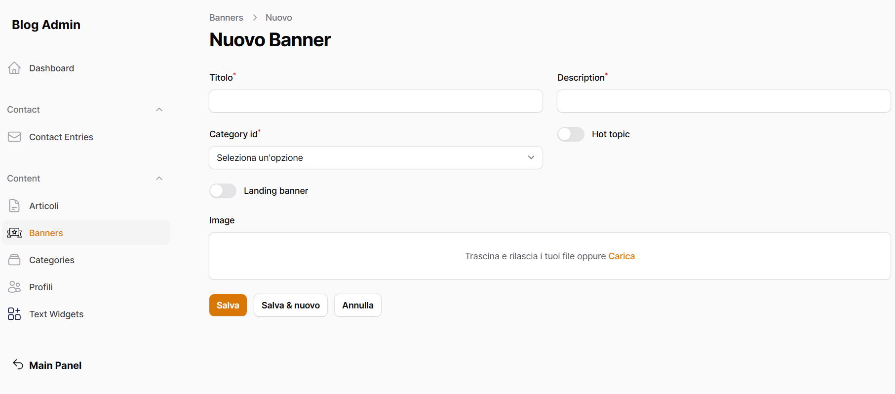
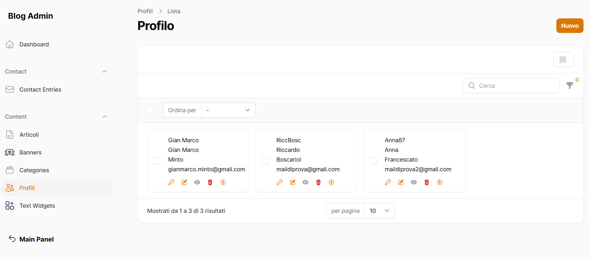
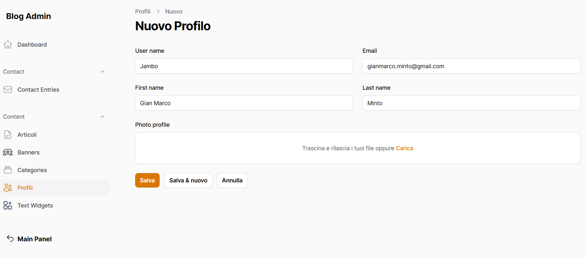

# Module Blog

Modulo dedicato alla gestione di un blog

## Aggiungere Modulo nella base del progetto

Dentro la cartella laravel/Modules

```bash
git submodule add https://github.com/laraxot/module_blog_fila3.git Blog
```

## Verificare che il modulo sia attivo

```bash
php artisan module:list
```

in caso abilitarlo

```bash
php artisan module:enable Blog
```

## Eseguire le migrazioni

```bash
php artisan module:migrate Blog
```

## Inserire le dipendenze

Per installare correttamente il modulo Blog è necessario installare le dipendenze dei 3 seguenti moduli:

- [UI](https://github.com/laraxot/module_ui_fila3/blob/dev/README.md)
- [Xot](https://github.com/laraxot/module_xot_fila3/blob/dev/README.md)
- [Tenant](https://github.com/laraxot/module_tenant_fila3/blob/dev/README.md)

Leggere ed eseguire correttamente le istruzioni all'interno dei file README.md di ciascuno di questi moduli

## [Gestione delle pagine frontend](docs/pages.md)

## Contenuti

* Articoli
* Categorie
* Banner
* Profili

### Articoli

##### Accesso

L'accesso alla sezione si effettua cliccando sulla voce "Articoli" del menu laterale.

<<<<<<< HEAD

=======

>>>>>>> d485805 (ripristino readme Blog)

##### Creazione di un nuovo articolo

* Cliccare sul pulsante in alto a destra "Nuovo"
<<<<<<< HEAD
* Inserire tutte le informazioni necessarie (segnate con *) e utili per rendere più chiara ed esaustiva l'indagine che si vuole creareLa struttura di un articolo ha una composizione "a blocchi", è possibile cioè inserire tipologie diverse di elementi quali "Titolo", "Paragrafo", "Immagine", "Carosello di immagini", "Opzione di risposta" e "Grafico" e spostarli all'interno della composizione stessa della pagina trascinando i blocchi interessati sopra o sotto.
=======
* Inserire tutte le informazioni necessarie (segnate con *) e utili per rendere più chiara ed esaustiva l'indagine che si vuole creareLa struttura di un articolo ha una composizione "a blocchi", è possibile cioè inserire tipologie diverse di elementi quali "Titolo", "Paragrafo", "Immagine", "Carosello di immagini", "Opzione di risposta" e "Grafico" e spostarli all'interno della composizione stessa della pagina trascinando i blocchi interessati sopra o sotto.
>>>>>>> d485805 (ripristino readme Blog)

  Al termine della creazione, per salvare il nuovo articolo è sufficiente cliccare sul pulsante "Salva".

### Categorie

Come il nome suggerisce, rappresentano i temi che contraddistinguono gli articoli/indagini all'interno della piattaforma. Ogni Articolo appartiene ad una specifica Categoria.

##### Accesso

L'accesso alla sezione si effettua cliccando sulla voce "Categorie" dal menu laterale.

<<<<<<< HEAD

=======

>>>>>>> d485805 (ripristino readme Blog)

Le categorie principali corrispondono a "Sport", "Politica", "Scienza", "Intrattenimento", "Affari e finanze".

##### Creazione di una nuova categoria

Per inserire una nuova categoria è sufficiente cliccare sul pulsante in alto a destra "Nuovo".

<<<<<<< HEAD

=======

>>>>>>> d485805 (ripristino readme Blog)

Per completare l'inserimento di una nuova categoria è necessario compilare tutti i campi obbligatori quali "Titolo della categoria" e "slug".

Per rendere una categoria più chiara ed esauriente è possibile inserire una breve descrizione della stessa, caricare un'immagine e/o un'icona che la rappresenti.

Al termine della creazione, per salvare la nuova categoria è sufficiente cliccare sul pulsante "Salva".

### Banners

I Banners rappresentano le copertine che sfogliano a modi carosello nella Homepage della piattaforma.

##### Accesso

Per accedere alla lista dei banners è sufficiente cliccare sulla voce "Banners" dal menu laterale.

<<<<<<< HEAD

=======

>>>>>>> d485805 (ripristino readme Blog)

##### Creazione di un nuovo banner

Per aggiungere un nuovo banner si deve cliccare sul pulsante in alto a destra "Nuovo".

<<<<<<< HEAD

=======

>>>>>>> d485805 (ripristino readme Blog)

Per completare l'inserimento è necessario compilare tutti i campi obbligatori (contraddistinti dal *), quali "Titolo", "Descrizione" e "Category ID". Gli altri campi non sono obbligatori ma sono utili per rendere più chiara l'utilità del banner in questione.

Al termine della creazione, per salvare il nuovo banner è sufficiente cliccare sul pulsante "Salva".

### Profili

Come il nome suggerisce, è la sezione in cui si possono consultare tutti i profili registrati nella piattaforma.

##### Accesso

Per accedere alla lista dei profili, è sufficiente cliccare sulla voce "Profili" dal menu laterale.

<<<<<<< HEAD

=======

>>>>>>> d485805 (ripristino readme Blog)

##### Creazione di un nuovo profilo

Per creareun nuovo profilo, cliccare sul pulsante "Nuovo" in alto a destra.

<<<<<<< HEAD

=======

>>>>>>> d485805 (ripristino readme Blog)

Le informazioni più importanti da inserire per ogni profilo sono "Username", "email", "First Name" e "Last Name". Le prime due sono voci univoche, non è possibile avere due profili con lo stesso Username o con lo stesso indirizzo email.

Per terminare la creazione di un nuovo profilo, è sufficiente cliccare sul pulsante "Salva".
